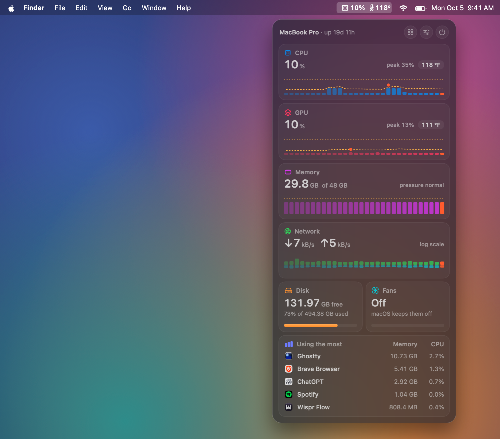
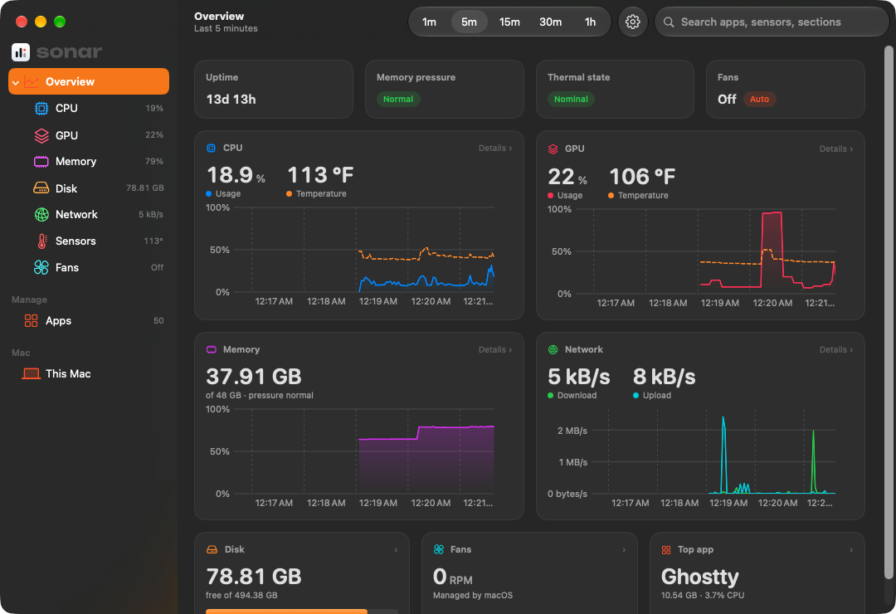
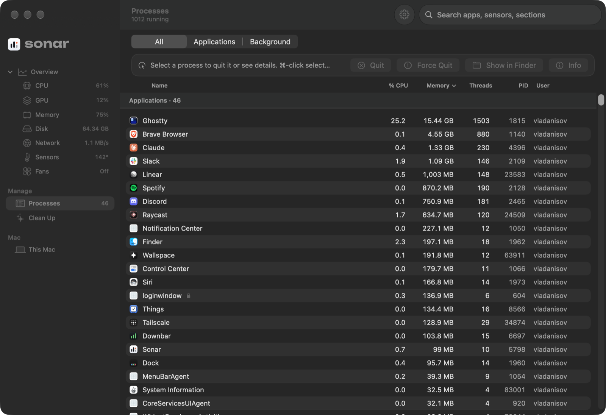
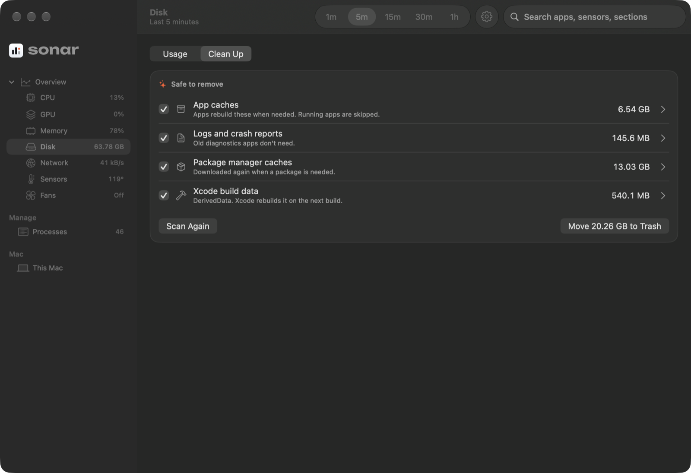

# sonar

<p align="center">
  
</p>

<p align="center">
  <a href="#install">install</a> · <a href="#features">features</a> · <a href="#build-from-source">build from source</a> · <a href="#how-it-works">how it works</a> · <a href="CHANGELOG.md">changelog</a>
</p>

<p align="center">
  <a href="https://github.com/vanisov/sonar/actions/workflows/ci.yml"></a>
  <a href="LICENSE"></a>
  
  
  
  <a href="https://github.com/vanisov/sonar/releases/latest"></a>
</p>

---

<p align="center">
  
</p>
<p align="center">
  
  &nbsp;
  
  &nbsp;
  
</p>

**your mac, at a glance.** a tiny, native menu bar monitor for Apple silicon.

**why sonar?** there are plenty of system monitors for the Mac, but few are open source, and none were quite what I wanted. sonar didn't need to exist. I built it because I wanted to craft something modern, sleek and beautiful that's still lightweight and absolutely functional. this is just the start: I have lots of ideas for growing it into a one-stop shop for your Mac.

## features

- **everything in one glance** — CPU, GPU, memory and network as column graphs you can read at a glance, with temperature drawn right on the CPU and GPU graphs, the recent peak marked, and the exact value at any moment on hover. disk, fans and the apps using the most sit underneath.
- **a real dashboard** — a page for every metric with column graphs over 1 minute to 1 hour (hover for exact values), min / average / max, every CPU core, where your memory goes, what your storage is used by (in the same categories as System Settings), disk activity, network interfaces, fans, and an About-this-Mac page with battery health. search it all with ⌘F.
- **real temperatures** — CPU and GPU temperatures straight from the SMC, in °C or °F, averaged or hottest-core. sensors are discovered per chip at launch instead of hard-coded tables (developed on an M4 Pro, reports from other chips welcome).
- **your menu bar, your way** — pick any mix of CPU %, temperatures, memory, network and fan speed, reorder them, show icons or values, and have them turn orange or red when something needs attention.
- **full control** — a proper Settings window (⌘,) for the menu bar, panel, dashboard, units, a global keyboard shortcut, and appearance.
- **a task manager that's pleasant to use** — every app and background process, sortable and searchable by name or PID. select one or several and use the control bar to quit, force quit, show in Finder or see details. apps show their real total with helpers included, and other users' and system processes are locked, so you can't end something your Mac needs.
- **clean up** — a tab on the Disk page that finds what's safe to remove: app caches, logs, package manager caches (Homebrew, npm, Yarn, pip…) and Xcode build data. it shows exactly how big each is and moves what you pick to the Trash, so nothing is gone until you empty it. it only lists things that rebuild themselves, skips anything a running app or tool used in the last hour, and only ever looks inside your home folder.
- **light on your mac** — about 0.5% of one core when idle, no helper tools, no root, no telemetry. expensive readings only run while you're looking, and windows are torn down when you close them.
- **100% Swift** — SwiftUI, AppKit and Swift Charts, no dependencies.

## install

1. download `Sonar.zip` from the [latest release](https://github.com/vanisov/sonar/releases/latest)
2. unzip it and drag **Sonar.app** into **Applications**
3. open it. the first time, macOS will block it because it isn't notarized: go to **System Settings → Privacy & Security** and click **Open Anyway**

Sonar lives in your menu bar. click it to open the panel, click any card to open the dashboard, and press ⌘, (or the sliders button) for Settings.

to update, turn on **Settings → About → Automatically check for updates**, or download the new zip and replace the app.

## build from source

needs Xcode 26 (for SwiftUI's macros) and macOS 14 or later. if `xcode-select -p` prints `CommandLineTools`, see [CONTRIBUTING.md](CONTRIBUTING.md#setup) first.

```bash
git clone https://github.com/vanisov/sonar
cd sonar
./bundle.sh install   # builds Sonar.app and copies it to /Applications
```

`./bundle.sh` on its own builds `build/Sonar.app` and `build/Sonar.zip` without installing. for quick iteration, `swift run` or open `Package.swift` in Xcode.

`docs/hero.png` comes from the real app: `docs/make-hero.swift` places a `--snapshot` of the panel on a desktop scene (see the comment at its top).

the app icon is drawn in code: edit `icon/make-icon.swift` and run it to regenerate `icon/Sonar.icns`. the "sonar" wordmark is traced from the Unbounded typeface by `icon/make-wordmark.swift`, so the app ships a small shape instead of a font file.

`./perf.sh` checks the running app against its idle budget (CPU, memory, wake-ups). open and close the panel, dashboard and Settings once first, then run it with everything closed.

## how it works

| metric | source |
|---|---|
| CPU | `host_processor_info` tick deltas |
| GPU | IOKit `IOAccelerator` performance statistics |
| memory | `host_statistics64` (app + wired + compressed, like Activity Monitor) and the kernel's memory pressure level |
| disk | volume capacity "available for important usage", which matches Finder |
| network | 64-bit interface counters from `sysctl`, physical interfaces only so VPNs aren't double-counted |
| temperatures, fans | read-only SMC access through IOKit |
| top apps | `proc_pid_rusage`, grouped by the responsible app |

cheap readings (CPU, memory, network) run every 2 seconds. expensive ones (GPU, temperatures, fans, per-app usage) run every 2 seconds only while the panel or dashboard is open, or when the menu bar shows them, and every 10 seconds otherwise. an hour of history is kept in memory in fixed-size buffers. nothing is written to disk except your settings.

## privacy

Sonar has no analytics, no telemetry and no account. everything it reads stays on your Mac, and only your settings are written to disk.

the only network request Sonar can make is the update check: once a day it asks GitHub for the list of Sonar releases. it's **off until you turn it on** in Settings → About, and nothing about you or your Mac is sent.

## troubleshooting

**temperatures look wrong or are missing?** Apple doesn't document SMC sensor codes, so new chips can surprise us. run

```bash
/Applications/Sonar.app/Contents/MacOS/Sonar --snapshot ~/Desktop/sonar.png
```

and [open an issue](https://github.com/vanisov/sonar/issues) with the output and your Mac model.

## contributing

contributions are welcome. read [CONTRIBUTING.md](CONTRIBUTING.md) before opening a PR, and see what changed in each version in [CHANGELOG.md](CHANGELOG.md). releases follow [semantic versioning](docs/RELEASING.md).

## agent instructions

if you are an AI agent working on this repository, read [`AGENTS.md`](AGENTS.md) before making changes.

## thanks

- SMC and sensor research by the [Stats](https://github.com/exelban/stats) project was a great reference.
- the wordmark is traced from [Unbounded](https://github.com/googlefonts/unbounded) by The Unbounded Project Authors, licensed under the SIL Open Font License 1.1.

## license

Sonar is licensed under the [MIT License](LICENSE).
