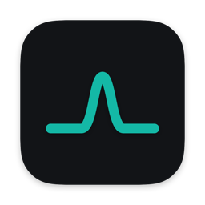
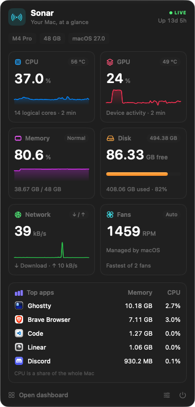

# sonar

<p align="center">
  
</p>

<p align="center">
  <a href="#install">install</a> · <a href="#features">features</a> · <a href="#build-from-source">build from source</a> · <a href="#how-it-works">how it works</a> · <a href="CHANGELOG.md">changelog</a>
</p>

<p align="center">
  <a href="https://github.com/vanisov/sonar/actions/workflows/ci.yml"></a>
  <a href="LICENSE"></a>
  
  
  
  <a href="https://github.com/vanisov/sonar/releases/latest"></a>
</p>

---

<p align="center">
  
</p>

**your mac, at a glance.** a tiny, native menu bar monitor for Apple silicon.

**why sonar?** there are plenty of system monitors for the Mac, but few are open source, and none were quite what I wanted. sonar didn't need to exist. I built it because I wanted to craft something modern, sleek and beautiful that's still lightweight and absolutely functional. this is just the start: I have lots of ideas for growing it into a one-stop shop for your Mac.

## features

- **everything in one glance** — CPU, GPU, memory, disk, network, fans and your hungriest apps, in one panel that feels like it shipped with macOS.
- **real temperatures** — CPU and GPU temperatures straight from the SMC. sensors are discovered per chip at launch instead of hard-coded tables (developed on an M4 Pro, reports from other chips welcome).
- **your numbers in the menu bar** — pick any mix of CPU %, CPU temp, GPU temp, memory, network and fan speed.
- **a dashboard when you want more** — an hour of history for every metric, every temperature sensor on your Mac, and a sortable list of every app.
- **apps, not processes** — helpers are counted toward the app that owns them, so Safari's web content processes show up as Safari.
- **light on your mac** — about 0.3% of one core and ~20 MB of memory when idle, no idle wake-ups, no helper tools, no root, no network access, no telemetry. expensive readings only run while you're looking.
- **100% Swift** — SwiftUI and Swift Charts, no dependencies, about 1,000 lines.

## install

1. download `Sonar.zip` from the [latest release](https://github.com/vanisov/sonar/releases/latest)
2. unzip it and drag **Sonar.app** into **Applications**
3. open it. the first time, macOS will block it because it isn't notarized: go to **System Settings → Privacy & Security** and click **Open Anyway**

Sonar lives in your menu bar. click the icon to open the panel, and use the sliders button to choose what shows in the menu bar and to launch it at login.

## build from source

needs Xcode (for SwiftUI's macros) and macOS 14 or later.

```bash
git clone https://github.com/vanisov/sonar
cd sonar
./bundle.sh install   # builds Sonar.app and copies it to /Applications
```

`./bundle.sh` on its own builds `build/Sonar.app` and `build/Sonar.zip` without installing. for quick iteration, `swift run` or open `Package.swift` in Xcode.

the app icon is drawn in code: edit `Icon/make-icon.swift` and run it to regenerate `Icon/Sonar.icns`.

`./perf.sh` checks the running app against its idle budget (CPU, memory, wake-ups). close the panel first.

## how it works

| metric | source |
|---|---|
| CPU | `host_processor_info` tick deltas |
| GPU | IOKit `IOAccelerator` performance statistics |
| memory | `host_statistics64` (app + wired + compressed, like Activity Monitor) and the kernel's memory pressure level |
| disk | volume capacity "available for important usage", which matches Finder |
| network | 64-bit interface counters from `sysctl`, physical interfaces only so VPNs aren't double-counted |
| temperatures, fans | read-only SMC access through IOKit |
| top apps | `proc_pid_rusage`, grouped by the responsible app |

cheap readings (CPU, memory, network) run every 2 seconds. expensive ones (GPU, temperatures, fans, per-app usage) run every 2 seconds only while the panel or dashboard is open, or when the menu bar shows them, and every 10 seconds otherwise. an hour of history is kept in memory in fixed-size buffers. nothing is written to disk except your settings.

## troubleshooting

**temperatures look wrong or are missing?** Apple doesn't document SMC sensor codes, so new chips can surprise us. run

```bash
/Applications/Sonar.app/Contents/MacOS/Sonar --snapshot ~/Desktop/sonar.png
```

and [open an issue](https://github.com/vanisov/sonar/issues) with the output and your Mac model.

## contributing

contributions are welcome. read [CONTRIBUTING.md](CONTRIBUTING.md) before opening a PR, and see what changed in each version in [CHANGELOG.md](CHANGELOG.md). releases follow [semantic versioning](docs/RELEASING.md).

## agent instructions

if you are an AI agent working on this repository, read [`AGENTS.md`](AGENTS.md) before making changes.

## thanks

SMC and sensor research by the [Stats](https://github.com/exelban/stats) project was a great reference.

## license

Sonar is licensed under the [MIT License](LICENSE).
